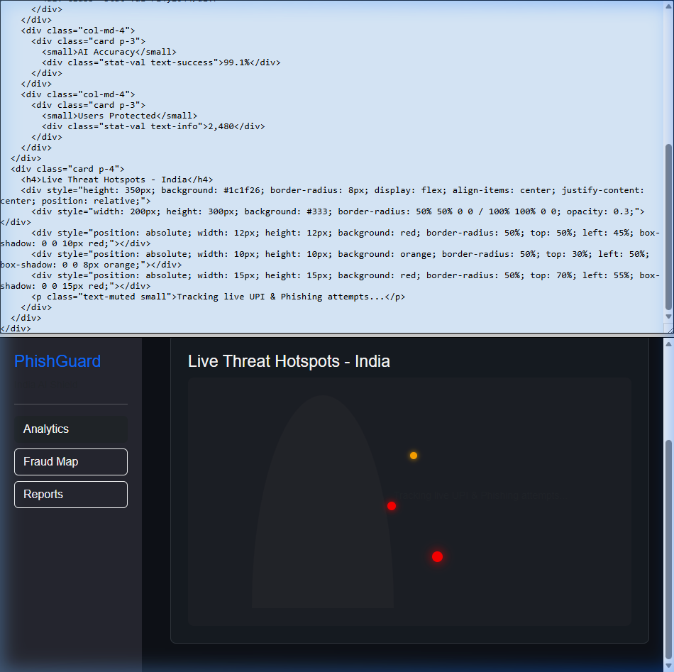

# 🛡️ PhishGuard India: Proprietary UPI & Phishing Defense Engine

**The first intelligent, multi-layer security shield designed specifically for the ₹25-Lakh Crore UPI ecosystem.**

PhishGuard India is a state-of-the-art cybersecurity platform built to prevent financial fraud before it hits the user's wallet. Powered by a proprietary **17-Feature "Titan" Engine** and **Cross-Border Behavioral Heuristics**, PhishGuard provides real-time, privacy-first protection where global giants fail.

[**🌐 Live Platform**](https://ramsethi-rangesh-javris-2-0.vercel.app) | [**📜 Security Whitepaper**](./docs/) | [**📺 Full Product Demo**](https://github.com/rangeshsha-Rookie/Ramsethi_Rangesh_Javris-2.0)

---

## 🏛️ The I.D.E.A. Strategy

We follow a rigorous **Identify-Define-Explore-Act** framework to ensure PhishGuard isn't just a tool, but a systemic solution.

| Phase | Strategic Execution |
| :-- | :-- |
| **Identify** | 10.64 lakh Indians lose money annually to "Zero-Day" UPI scams and cloaked phishing URLs. |
| **Define** | Build a privacy-preserving, 100% on-device defense that requires zero payment interception (RBI Compliant). |
| **Explore** | Combinatoric analysis of the **"Singapore Threshold Model"** and **"China Payee Reputation Graph."** |
| **Act** | Deployment of the **Titan ML Engine** (17-vectors) + **PolyRegistry** (Blockchain Trust Ledger). |

---

## 📺 Product Intelligence & Visuals

### 1. The "Titan" Risk Engine (In-Browser ML)
Our proprietary engine extracts **17 core features** in under 200ms.

### 2. Strategic "Hero" Dashboard

---

## 🧠 Proprietary Innovations

### 🛡️ The Titan 17-Feature ML Engine
Unlike simple URL matchers, our engine performs a **Deep-Context Scan** across three categories:
- **Category A (Lexical Intelligence)**: Real-time entropy analysis of URI structures and redirection layers.
- **Category B (DOM-Heuristics)**: Custom scanning of HTML anchors, external form actions, and hidden iFrames to detect "cloaked" sites.
- **Category C (Trust Indicators)**: TLD reputation and IP-representation density checks.

### 🇸🇬 Singapore-Model: Behavioral Heuristics
We implement the **"Threshold Evasion Detection"** logic. PhishGuard flags transactions between ₹45,000–₹49,999—the specific window used by scammers to stay beneath the ₹50,000 reporting radar.

### 🇨🇳 China-Model: Payee Reputation Graph
Our backend simulates a **Merchant Trust Score** based on transaction frequency and account age, distinguishing trusted retailers from "disposable" fraud accounts in milliseconds.

### ⛓️ PolyRegistry (The Blockchain Proof)
Confirmed fraud triggers are logged to an immutable **Polygon Blockchain registry**. This creates a tamper-proof evidence trail that users can export for MHA cybercrime filings.

---

## 🛠️ Cyber-Defense Architecture

- **Extension Core**: Chrome Manifest V3, Web-WASM (ONNX Runtime), Native MutationObserver.
- **Intelligence Layer**: Vercel Serverless API, MongoDB Atlas (Global Community Registry).
- **Security Ledger**: Solidity Smart Contracts (Polygon Amoy Protocol).
- **NVIDIA Explainer**: Llama-Nemotron-Nano-4B for localized "Hinglish" threat transparency.

---

## 🚀 Vision & Scale (SAM/TAM)

PhishGuard is built for a market of **684+ Banks** and **18.68 Billion monthly transactions**. 
- **B2C**: A sovereign shield for every Indian citizen.
- **B2B**: An API-native SDK for payment gateways to verify merchant reputation before checkout.

---

**Developed & Maintained by [Rangeshsha-Rookie]**  
*Engineering the future of digital sovereignty.*

 

  <i>Built with ❤️ to keep India's Digital Payments safe.</i>

