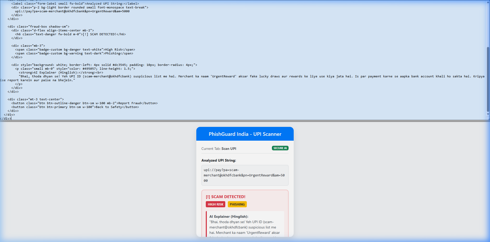
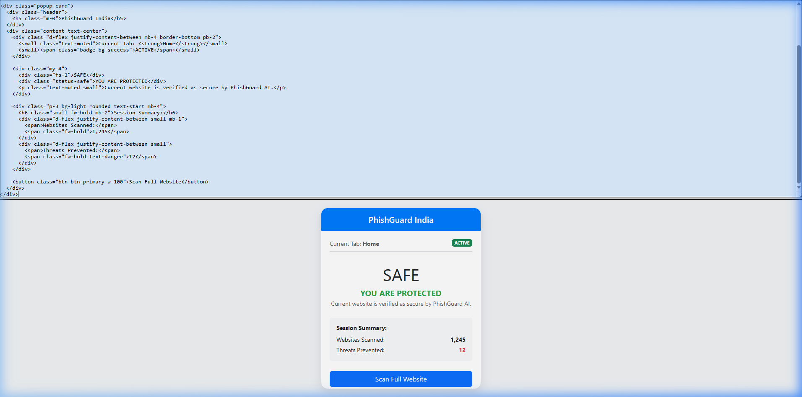

  
    
  <h1>🛡️ PhishGuard India</h1>
  
<b>Proactive, AI-Powered Protection against UPI Frauds & URL Phishing natively on your device.</b>

  
  
  
  

---

## 📺 Project Demo & Visuals

### 1. Centralized Threat Dashboard

### 2. Intelligent UPI Analysis (Hinglish AI)

  
  

---

## 🚨 The Problem

In India, digital adoption has skyrocketed, and so has financial fraud. Every year, millions of users are tricked into losing their hard-earned money by:
1. Scanning physically manipulated or deeply injected **fake UPI QR codes**.
2. Clicking **malicious phishing URLs** designed to mimic legitimate banks and e-commerce sites.

Current solutions rely on cloud-based servers and known blacklists, which means a scammer is only blocked *after* they have already scammed innocent victims. Furthermore, sending all your payment data to a central server compromises your privacy.

## 💡 Our Solution

**PhishGuard India** is a lightweight, strictly privacy-preserving Chrome Extension that acts as your personal cyber-security detail. It catches zero-day attacks dynamically.

Instead of matching against a list, it uses **Offline Machine Learning** and a **Proprietary Fuzzy-Matching Algorithm** right inside your browser to predict if a URL or QR code is malicious before you interact with it.

---

## ✨ Key Technical Innovations

### 1. 🧠 In-Browser Machine Learning (ONNX)
We trained an **XGBoost Classifier** on a robust dataset of 10,000+ phishing/legitimate websites using 16 behavioral heuristics (depth of URL, TLDs, IP representations, etc.). 
* **The Magic:** We converted the XGBoost Model to an `.onnx` binary (under 100KB), allowing it to run inference natively directly inside the browser using JavaScript. Zero latency. Zero server API calls.

### 2. 🔍 Proprietary UPI 5-Point Discrepancy Analyzer
Scammers frequently upload their VPA (e.g. `fraudster99@ybl`) but change the Display Name to something official like `Amazon Pay`. 
We built an offline text-analysis engine that dissects `upi://pay` deep links to run 5 strict checks:
* **Fuzzy Mismatch Detection:** Computes the Levenshtein distance between the `pa` (VPA) and `pn` (Name). If there is a massive mismatch, it automatically issues a **BLOCK** recommendation.
* **Threshold Evasion Catching:** Flags transactions sitting perfectly beneath the RBI ₹50,000 alert ceiling (e.g. ₹49,999).
* Structure validation and digit-ratio density checks.

### 3. 📷 Invisible DOM QR Interception
Our extension seamlessly hooks into the active webpage. Using `jsQR`, it searches through DOM `` and `<canvas>` elements to decode QR patterns. If it finds a malicious UPI link on your desktop screen, it throws a full-screen red warning modal—protecting you *before* you scan it with your phone!

---

## 🛠️ Tech Stack

* **Frontend / UI:** Vanilla HTML/CSS/JS (Lightweight, No bloat)
* **Extension API:** Chrome Manifest V3
* **Machine Learning:** Scikit-Learn, XGBoost, ONNXMLTools
* **In-Memory Inference:** ONNXRuntime-Web
* **QR Processing:** jsQR

---

## 🚀 How to Install & Test Properly

Want to test PhishGuard on your machine?

1. **Clone this repository** to your local machine.
2. Open Google Chrome and type `chrome://extensions/` in the URL bar.
3. Toggle **"Developer Mode"** ON in the top right corner.
4. Click **"Load Unpacked"** in the top left corner.
5. Select the `phishguard-india/extension/` folder in this repository.

**Test Case 1: The UI & Live URL Scanning**
* Navigate to any website. Click the PhishGuard icon in your extension tray. It will analyze your current URL and visibly display your safety score.

**Test Case 2: The UPI Mismatch Engine**
* Open the Extension Popup and click the **"Scan UPI"** tab.
* Paste this fraudulent string: `upi://pay?pa=randomaccount99@ybl&pn=Amazon Pay&am=49000&cu=INR`
* Click Analyze. Watch the proprietary fuzzy-matcher flag it as completely dangerous immediately.

---

## 🔮 Future Roadmap (Scaling Phase)
While currently an offline extension, our architecture is designed to expand into a complete ecosystem:
* **Phase 4 - Analytics Hub:** A Streamlit Dashboard enabling users to track real-time threat maps across India.
* **Phase 5 - Polygon BlockChain Integration:** Implementing a zero-knowledge smart contract (`FraudRegistry.sol`) on Polygon Amoy. This enables decentralized, tamper-proof reporting of fraudulent VPAs so the entire network learns universally without centralized control.
* **Phase 6 - Mobile SDK:** Decoupling the UPI Analyzer to be sold as a B2B SDK for payment providers like PhonePe or GPay.

 

  <i>Built with ❤️ to keep India's Digital Payments safe.</i>

